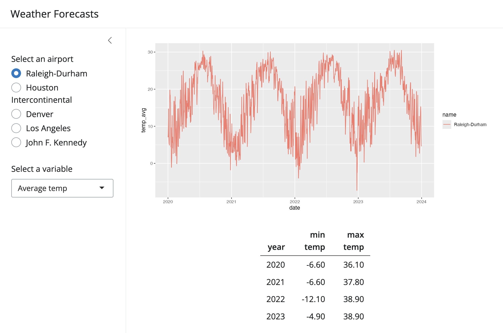
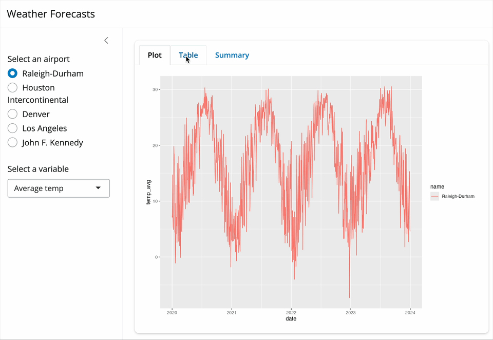
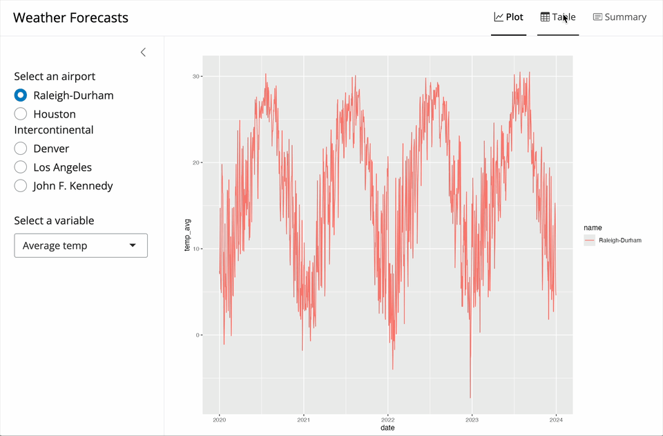

# Instructions

Welcome to your first week of Shiny milestones! Throughout this course, we will use these sessions to work in small groups to further explore what is possible with Shiny, helping you build and solidify your Shiny skills.

By the end of this course, you will build your own Shiny app using the skills you learned throughout the week and during these sessions.

Because building a good app takes time and consideration, we recommend this schedule for building your app throughout this course:

* **Week 1** - Begin thinking about what kind of app you might like to build. Take a look at the [Shiny gallery](https://shiny.posit.co/r/gallery/), particularly the user showcase, for some inspiration.

* **Week 2** - Identify what data you will be using with your app. When you have your data, make sure it can be read into R.

* **Week 3** - Sketch out a basic UI and consider the kinds of interactivity you want in your app. Connect with your colleagues for feedback on your app plans and start to build your app.

* **Working week** - Connect with your mentor 1:1 to share your app in progress,and gather additional ideas and feedback. Continue building your app.

* **Week 4** - Finish building your app, test your app, and publish it to the Posit Connect server for a showcase on your final milestone day.

You will build your own app in the capstone project (see the `shiny_04` folder), where a lightly scaffolded `app.R` is waiting for you; you can start work on your app there at any point in time. (If you have questions about this timeline or the capstone project, please reach out to your mentor.)

Now back to the milestones! This week we will practice what we've learned individually this week and deepen our understanding of how to configure and customize basic Shiny apps. As you work through these exercises, consider what you might want to incorporate into your app.

 

## Exercise 1

Open `exercise1.R`; the code may look familiar from the app at the end of lesson 2. Briefly read through the code to refamiliarize yourself with this version of the app.

We will now explore some options for arranging the elements of our main panel, making our app better organized and easier for users to navigate.

Our first approach will be to make use of Bootstrap's columns layout to control the size and position of the elements in our main panel. This will allow us to create a more complex layout with elements of different relative sizes and positions. For now we will be using the most basic approach which is `bslib`s `layout_columns()` function.

Column details

At its most basic level, `layout_columns()` helps us create one or more rows of UI elements that are positioned based on a grid system. This grid system is based on a 12-column layout where each column is an equal fraction (1/12) of the total width of the row. Each UI element is then apportioned some integer number of these columns to determine its width.

For example, if we wanted to create a row with two columns of equal width we would use `layout_columns()` with `col_widths = c(6,6)`. If instead we wanted one column to be twice as wide as the other we would use `col_widths = c(8,4)`.

If more columns are specified than can fit in a row (i.e. > 12) then the UI elements will wrap to a new row. For example, `col_widths = c(12,6)` would create a row with a single full-width UI element and a second row with a half-width UI element.

You can also use negative values in `col_widths` to create empty columns (of specified width) to offset other elements. For example, `col_widths = c(-8,4)` results in a row with a single right aligned UI element that is 4 columns wide.

Based on the above information, work with team members in your breakout room to modify the existing app to create a layout where the `plotOutput()` remains the _full width_ of the app, while the `tableOutput()` is centered below it and occupies 1/3 the width of the body of the app.

Goal

The final app should look something like this:

 

## Exercise 2

Now open `exercise2.R`, which shows the same code that we started with for Exercise 1.

Our next approach will be to use bslib's `navset_card_tab()` function to create a tabbed interface. This will allow us to separate our plot output from our table output.

A `navset_card_tab()` is an example of a _tab panel_. A tab panel is a UI element that is composed of individual tabs that can be clicked to reveal different content. This is a common pattern in web applications and can be useful for organizing content in a way that is easy to navigate. With bslib, each of these tabs is constructed using `nav_panel()`, which are passed as the arguments to `navset_card_tab()`.

Each `nav_panel()` is defined by a `title`, which is the text that shows in the tab, and then a collection of UI elements (e.g. `plotOutput()`, `tableOutput()`, etc.) that will be displayed when that tab is selected.

See the documentation for more details and examples: `?navset_card_tab` and `?nav_panel`.

Together with your breakout room, work to modify the existing app to add the following features:

* Add a tab panel to the main body of the app, this panel should have three tabs:

  * `Plot` - containing the `plotOutput()` widget that currently displays the plot.

  * `Table` - containing the `tableOutput()` widget that currently displays the table.

  * `Summary` - containing a `verbatimTextOutput()` widget that displays a brief summary of the currently selected airport (name, code, and state) and the currently selected variable.

Hint

You will need to add a new render function to your `server` function to handle the `verbatimTextOutput()` widget. This function should return a character string that contains the summary information you want to display. Note that both `verbatimTextOutput()` and `textOutput()` use the `renderText()` function to generate their content.

Goal

The final app should look something like this:

Stretch goal, Exercise 2

If your group finishes early, try changing the layout of the tab panel to use one of bslib's alternative layouts. Try changing `navset_card_tab()` to any of the following and see how the layout changes:

* `navset_tab()`

* `navset_pill()`

* `navset_card_pill()`

* `navset_pill_list()`

 

## Exercise 3 (Optional)

**Note:** Your group may not complete this during the session; if not, we recommend returning to this exercise on your own time.

Another alternative provided by bslib is the `page_navbar()` layout. This layout includes everything that `page_sidebar()` does, with the addition of a top navigation bar (aka "navbar"). This allows us to place our "tab" titles in the navbar and have the content of the tabs displayed in the main body of the app. As with `page_sidebar()`, `page_navbar()` is a modernized replacement for Shiny's `navbarPage()` layout.

The implementation of `page_navbar()` is similar to `tabsetPanel()` in that it uses `nav_panel()` elements to define the tabs. These `nav_panel()` elements take the same `title` and UI element arguments as `tabPanel()`. They also take an optional `icon` argument which can be used to add an icon to the tab.

Work to modify your app from exercise 2 to use `page_navbar()` and `nav_panel()`s in place of `navset_card_tab()` and `nav_panel()`s. Select and add an _appropriate icon_ to each tab - icons can be included using `bsicons::bs_icon()` and an icon name from the [Bootstrap Icons library](https://icons.getbootstrap.com/){target=blank_}.

Hint

You can use `nav_spacer()` before `nav_panel()` to add space between the title and the panel titles in the navbar.

If you see a "hamburger menu" icon in the top right of the navbar, the app window is too small to display all the tab titles. To view all tab titles, increase the width of the window or you can pass `navbar_options = navbar_options(collapsible = FALSE)` to `page_navbar()` to prevent the navbar from collapsing.

Goal

Your final app should look something like:

