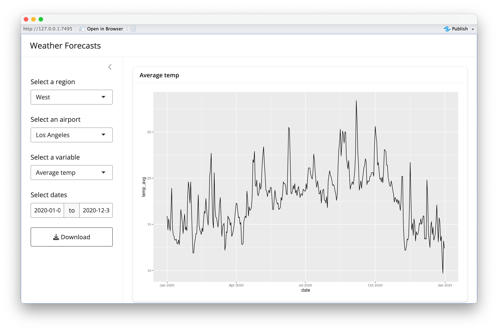
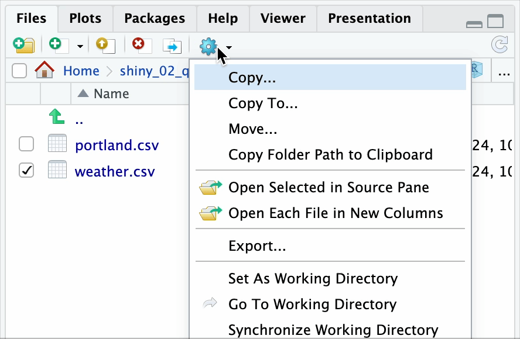
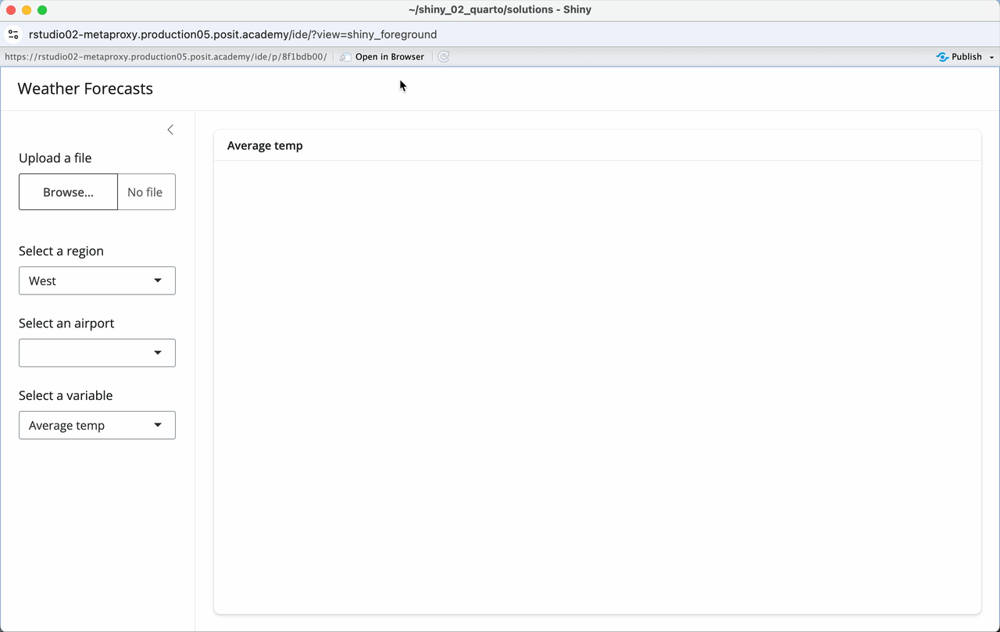

# Instructions

Welcome to week 2 of Shiny for R! Today we will learn a bit more about reactivity through exercises focused on uploading and downloading from Shiny.

Before we return to reactivity, a reminder of the recommended schedule for your course capstone project/app.

* Right now you should have a plan for what kind of app you want to build
* By the end of this week you should have identified a data set and confirmed that it can be read into R
* Next week, you'll move to planning your UI and interactive elements

Now let's look at reactivity.

 

## Exercise 1

Open `exercise1.R` and read through the code and comments. How do you think the `downloadButton()` and `downloadHandler()` functions work? Try running the app and experimenting with the download button to test your theories.

When you are done exploring, work with your group add a `dateRangeInput()` to the app to filter the data by date range using the steps below. (We recommend reading through the steps/workflow before you begin.)

**Step 1: Add the input and inspect it**

* Add a `dateRangeInput()` to the sidebar with `inputId = "dates"`
* Set `start` and `end` to the minimum and maximum dates in the data set
* Add `print(str(input$dates))` somewhere in the server function to see what the object looks like
* Run the app; how does the console output change when you adjust the date range?

**Step 2: Prototype the filter in a script**

* Outside of the app, open a new R script for all of the following steps:
* Create a test object: `dates <- c(ymd("2020-01-01"), ymd("2020-12-31"))`
* Read in the weather data: `d <- readr::read_csv("data/weather.csv")`
* Write code to filter `d` by date using your `dates` object
* Verify the filtering works; when you are satisfied, move to Step 3

**Step 3: Connect it to the app**

* Return to the app and move your (script) filtering code into the `d_city` reactive
* Replace your test `dates` object with `input$dates`
* Check 1: Does the plot update when you change the date range?
* Check 2: Does the downloaded data correctly reflect the specified data range?

**Suggested workflow:**

1. First, add the `dateRangeInput()` widget to the UI and run the app to see what it looks like
2. In the Console, try `print(str(input$dates))` to inspect what is returned (this should be a two-element vector)
3. In an R script (not the Shiny app), prototype the date filter using `dplyr::filter()` with the date range — make sure the logic works
4. Once the filter logic is working, add it to the `d_city()` reactive in your Shiny app

  
Goal

  
The revised app should look something like this if you select *Average temp* for *Los Angeles* airport from *2020-01-01* to *2020-12-31*.

  

  Right click above and select Open Image in New Tab to get a larger version of the image.

 

## Exercise 2

Now switch to `exercise2.R` and read through the comments and code.

This app is designed to illustrate the use of the `fileInput()` widget in Shiny. Your goal is to understand the behavior of the widget and how it handles file uploads in Shiny apps.

When you feel comfortable with the code in `exercise2.R`, try the following:

* Upload a CSV file. How does the app respond?

* Upload a non-CSV file. How does the app respond to this type of input?

 

## Exercise 3

Informed by what you observed in Exercise 2, we will add upload functionality to our weather app.

1. Using the code in `exercise3.R` as a starting point, replace the preloading of the weather data (`d`) with a `reactive()` version that is populated via a `fileInput()` widget. Alter the app so that the file upload works and the app behaves as before: the user can select different airports and plotting variables.

2. Your session includes both `data/weather.csv` (the full data set) and `data/portland.csv` (data for the Portland International Airport, PDX). First, download these files to your local machine (select the file, export/download). Revise your app so that _either_ file can be uploaded, preserving the same user options as before. (Note: In the case of the Portland data, only Portland should be selectable as an airport choice.)

  
Export

  
Goal

  

  Right click above and select Open Image in New Tab to get a larger version of the image.

  
Hint

  Remember that anywhere that previously references the data frame `d` will now need to use the reactive version which should be referenced using `d()` instead.

