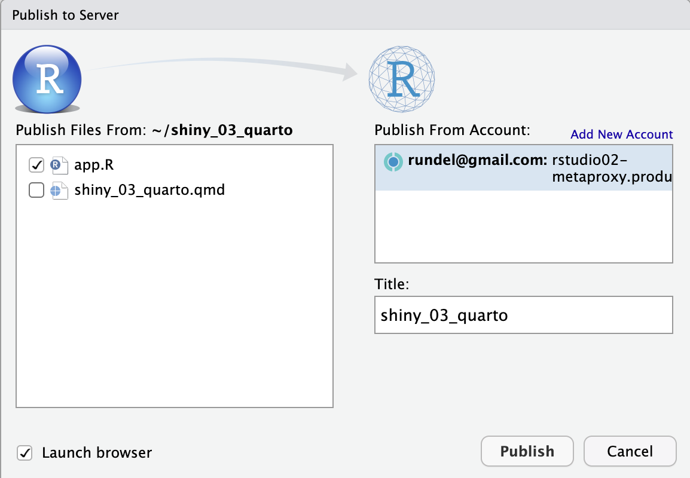
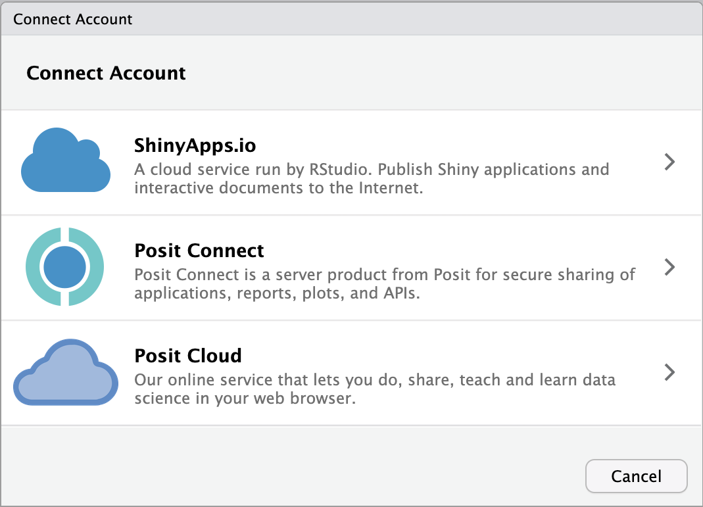
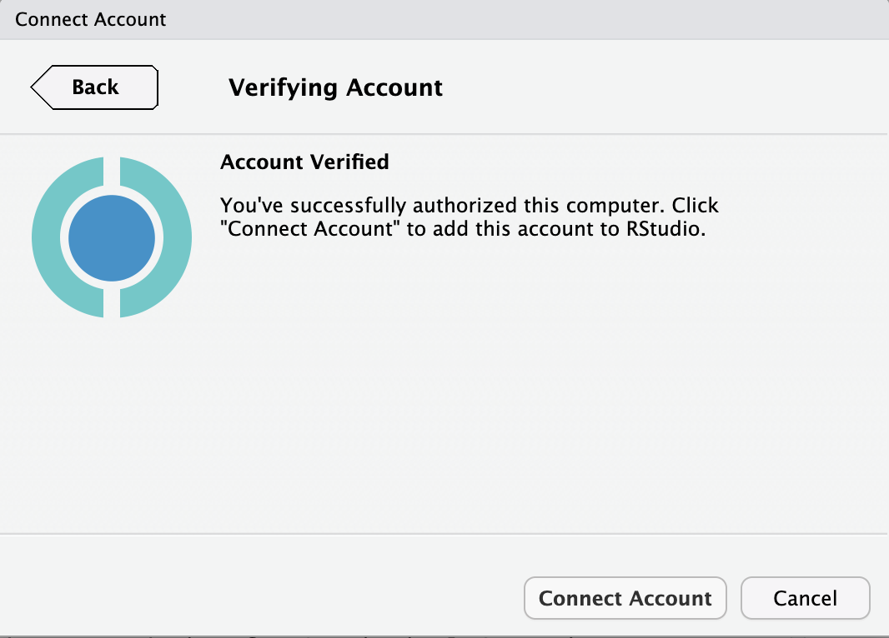
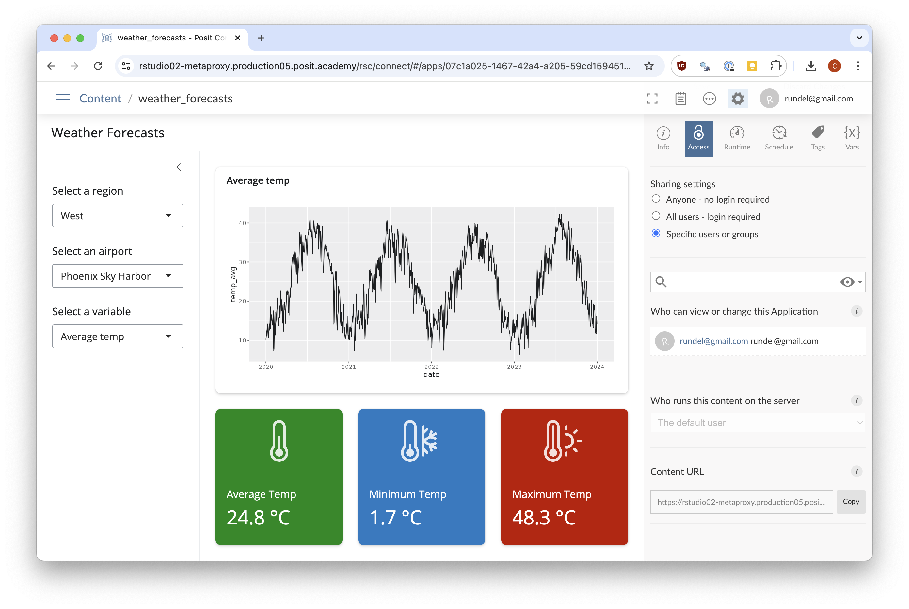

# Instructions

Welcome to week 3 of Shiny for R! Today we will further explore customizing our Shiny apps, then deploy our apps using Posit Connect so they can be shared with colleagues in this course.

Before we dive into this week's milestone, a reminder of the recommended schedule for your course capstone project/app.

* You should have a plan for what kind of app you want to build
* You should have identified a data set and confirmed that it can be read into R
* This week, you should sketch out a basic UI and consider the kinds of interactivity you want in your app. When you have your plans, connect with your colleagues for feedback, and start to build your app.
* During the _working week_ next week, you should connect with your mentor 1:1 to share your app in progress, gather additional ideas and feedback and continue building your app.

Now on to customization and deployment!

 

## Exercise 1

Open `app.R`, which may look familiar - this is the app that we worked with earlier this week - with two notable changes: we have enabled both `bs_themer()` and `thematic_shiny()` for you.

Work together in your breakout room to make this app **as ugly as possible** while still maintaining its basic functionality. (While this may seem silly, our goal is to explore the limits of what is possible in app customization without the constraint of beautiful design.)

We suggest starting with `bs_theme()` and picking a preset theme as the starting point for customization.Remember that any changes made with `bs_themer()` are temporary until you add them to the `theme = bs_theme()` in your app's `ui`. (Note: Each change you make should be accompanied by a message in the Console showing a call to `bs_theme_update()` that can be added to the existing theme.)

Additional Suggestions

* Choose a variable from this [table of Bootstrap variables](https://rstudio.github.io/bslib/articles/bs5-variables/index.html){target=blank_} and change its appearance by including it as a named argument to `bs_theme()`.

* Adjust the foreground and background colors; consider adjusting other (accent) colors to compliment.

* Alter the font(s) to perennial favorites like Comic Sans MS or Papyrus, or choose something from [Google Fonts](https://fonts.google.com/){target=blank_}.

* If you would like to move beyond the thermometer icon, the `bsicons` package provides a wide variety of options in a [filterable list](https://icons.getbootstrap.com/){target=blank_}.

* Remember that `card()`, `card_header()`, `card_body()` and `value_box()` can all be customized using the `class` argument. See the `value_box()` [documentation](https://rstudio.github.io/bslib/reference/value_box.html#themes){target=blank_} for some examples of customization.

* Consider adding images (or animated GIFs?) to your app (see Lesson 6 for details), or background images via `shinyWidgets::setBackgroundImage()`. (Note: you will need to install the shinyWidgets package.)

* If you completed the optional exercises on leaflet, plotly, and DT, you could add a map, graph, or table to showcase your theme with interactive visualizations.

 

## Exercise 2

Congratulations! You have crafted you own monument to bad design. We would like to share your fantastically ugly app with your colleagues in this course. To do this we will be publishing the app to Posit Connect.

We did not cover this process in Lesson 6 because it is specific to the environment we are using for this course and the Academy platform in particular. However, this is the same process that we will be using for you to deploy your personal projects at the end of the course. We are using Connect for this process because it provides access control for the deployed apps.

Step 1 - Connect

With `app.R` open click on the Publish button ({width=20px}) in the upper right.

You should be presented with one of two windows, if it is the "Publish to Server" window that looks like

**click on the "Add New Account" link** in the upper right.

Everyone should now see the "Connect Account" window that looks like

From this window **click on "Posit Connect"**. On the next page you can **click "Next"** and use the pre-populated Connect URL provided. Note if we were using a different connect service or a different IDE instance we would need to enter this URL manually.

Clicking should result in a new window opening in your browser that will ask you to confirm the connection, **click the "Connect" button** and when prompted you can safely close this window.

You should now be back in your IDE and the "Connect Account" window should now look like

You can finish the process by **clicking "Connect Account"**.

Step 2 - Publish

Once finished with Step 1, our "Publish to Server" window should look like something like

with the Connect target in the "Publish From Account" selection input. We can tell this is the target because of the Connect icon ({width=20px}) and the included url.

You can now go through the process of publishing your app to Connect. As with ShinyApps.io make sure you select all of the necessary components of your app before **clicking the "Publish" button**.

After clicking "Publish" there will be the typical deployment process with messages in the Deploy tab. When it completes you will be taken to the app's dashboard on the Connect server.

Step 3 - Share

Once published, you will are taken to the app's Connect dashboard, which resembles the ShinyApps.io dashboard we've seen previously. From here you can manage the app, view its logs, and most importantly share the app with others. The dashboard will look like

To share the app with others you will need to select the "Access" tab if it is not open already. And then **select "All users - login required"** from the "Sharing settings" options. This will allow anyone who has the app's url *and* is an authenticated user on this Connect server to access the app. Make sure to click the Save button after making this change.

More fine-grained access control is possible with the "Specific users" option, but this requires you to know the names or email addresses of all of the users you want to share the app with, which is tedious for a large group.

The shareable url for the app is available at the botton of the "Access" tab under the "Content URL" heading. **Click the copy button** to copy the url to your clipboard and then paste it into the Zoom chat for your breakout room.

Confirm that everything worked by having the other group members follow the link and run the app themselves.

Once you have confirmed that the app is available and working for everyone you can close the Connect dashboard and return to your IDE. If there are changes or fixes you would like to make to the app you can do so and then republish the app to Connect.

The "Publish to Server" dialog will recognize the app has been previously published and will update the app on Connect rather than creating a separate app. This is useful for iterative development and testing of the app. You can see this by the inclusion of the "Update" entry which includes the app's name and url.

